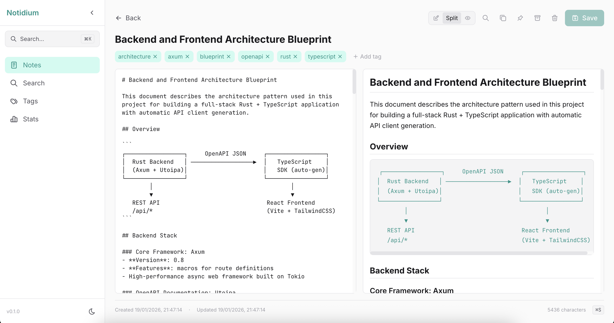

# Notidium

[](https://crates.io/crates/notidium)
[](LICENSE)

> Your developer knowledge, elementally organized.

A developer-focused, local-first note-taking application with semantic search and native MCP integration.



## Philosophy

- **Context is everything** — Code without context is just syntax. Notidium preserves the *why*, not just the *what*.
- **Search, don't organize** — Folders are a tax on future you. Semantic search means you write notes, not maintain systems.
- **Local-first, AI-native** — Your knowledge stays on your machine. AI assistants access it through MCP, not cloud APIs.
- **Developer-specific by design** — Not a general PKM adapted for code. Built from the ground up for how developers think and work.

## Features

- **Full-text search** powered by Tantivy
- **Semantic search** with BGE-small-en embeddings (384 dimensions)
- **MCP server** for Claude Desktop and other AI assistants
- **Markdown-first** with YAML frontmatter support
- **File-based storage** — your notes are just `.md` files
- **HTTP API** for web UI integration

## Installation

```bash
# Install from crates.io
cargo install notidium

# Or build from source
git clone https://github.com/pjankiewicz/notidium
cd notidium
cargo install --path .
```

## Quick Start

```bash
# Initialize a new vault
notidium init ~/Notidium

# Add some notes to ~/Notidium/notes/
echo "# My First Note\n\nHello, Notidium!" > ~/Notidium/notes/hello.md

# Index all notes (builds full-text + semantic search)
notidium index

# Search your notes
notidium search "hello"
notidium search --semantic "greeting message"

# Start the server (HTTP API + MCP + Web UI)
notidium serve

# Start MCP-only server for Claude Desktop (stdio mode)
notidium mcp
```

## CLI Commands

| Command | Description |
|---------|-------------|
| `notidium init [path]` | Initialize a new vault |
| `notidium serve [-p PORT]` | Start server with HTTP API, MCP, and Web UI (default: 3939) |
| `notidium mcp` | Start MCP-only server (stdio mode for Claude Desktop) |
| `notidium mcp-http [-p PORT]` | Start MCP-only server (HTTP mode, default: 3940) |
| `notidium index [-f]` | Index all notes with full-text + embeddings |
| `notidium search <query>` | Search notes (add `-s` for semantic) |
| `notidium list [-l LIMIT] [-t TAG]` | List all notes |
| `notidium stats` | Show vault statistics |

## MCP Integration

Notidium includes a built-in MCP server that exposes your knowledge base to AI assistants like Claude.

### Claude Code CLI

```bash
# Start notidium server first
notidium serve

# Add MCP server to Claude Code
claude mcp add --transport http notidium http://localhost:3939/mcp
```

### Claude Desktop Setup

Add to your `claude_desktop_config.json`:

```json
{
  "mcpServers": {
    "notidium": {
      "command": "/path/to/notidium",
      "args": ["mcp"]
    }
  }
}
```

### Available MCP Tools

| Tool | Description |
|------|-------------|
| `search_notes` | Search notes with full-text or semantic search |
| `get_note` | Get full note content by ID |
| `get_note_by_title` | Get note by title (fuzzy match) |
| `list_notes` | List notes with pagination and tag filter |
| `find_related` | Find semantically similar notes |
| `search_code` | Search code blocks with language filter |
| `create_note` | Create a new note |
| `update_note` | Replace note content |
| `delete_note` | Delete a note (moves to trash) |
| `append_to_note` | Append content to existing note |
| `quick_capture` | Quick capture to inbox |
| `get_stats` | Get knowledge base statistics |
| `get_tags` | Get all tags |

## HTTP API

When running `notidium serve`, the following endpoints are available:

```
GET  /health                 Health check
GET  /api/notes              List notes
POST /api/notes              Create note
GET  /api/notes/:id          Get note by ID
PUT  /api/notes/:id          Update note
DELETE /api/notes/:id        Delete note
GET  /api/search             Full-text search (?q=query)
GET  /api/search/semantic    Semantic search (?q=query)
GET  /api/notes/:id/related  Find related notes
POST /api/capture            Quick capture
GET  /api/tags               List all tags
GET  /api/stats              Get statistics
GET  /api/docs               Swagger UI
GET  /api/openapi.json       OpenAPI spec
POST /mcp                    MCP protocol endpoint
```

## Vault Structure

```
~/Notidium/
├── notes/                   # All markdown files
│   ├── inbox/               # Quick captures land here
│   └── *.md                 # Your notes
├── attachments/             # Images, PDFs, etc.
├── templates/               # Note templates
├── .notidium/               # App data (gitignore this)
│   ├── config.toml          # User preferences
│   ├── index.db             # SQLite metadata
│   ├── tantivy/             # Full-text search index
│   ├── vectors/             # Vector embeddings (LanceDB)
│   ├── chunks.json          # Embedded chunks cache
│   └── logs/                # Debug logs
└── .notidiumignore          # Files to skip indexing
```

## Note Format

Notes are standard Markdown files with optional YAML frontmatter:

```markdown
---
tags: [rust, oauth, tutorial]
aliases: [OAuth Setup, Auth Guide]
---

# Setting up OAuth in Rust

Here's how I configured OAuth for my Axum app...

```rust
let oauth_client = BasicClient::new(
    ClientId::new(client_id),
    Some(ClientSecret::new(client_secret)),
    AuthUrl::new(auth_url)?,
    Some(TokenUrl::new(token_url)?),
);
```

The key insight is to store tokens in Redis...
```

## Configuration

Create `~/Notidium/.notidium/config.toml`:

```toml
# Vault settings
notes_dir = "notes"
attachments_dir = "attachments"
templates_dir = "templates"

# Server settings
http_port = 3939
mcp_port = 3940

# Embedding settings
[embedding]
prose_model = "BAAI/bge-small-en-v1.5"
batch_size = 32

# Search settings
[search]
default_limit = 10
max_limit = 100
```

## Tech Stack

- **Rust** — Fast, safe, no runtime
- **Axum** — Async HTTP framework
- **Tantivy** — Full-text search engine
- **fastembed** — Local embedding inference
- **LanceDB** — Vector database
- **SQLite** — Metadata storage
- **rmcp** — MCP protocol implementation
- **pulldown-cmark** — Markdown parsing

## Development

```bash
# Run in development
cargo run -- serve

# Run tests
cargo test

# Build release
cargo build --release
```

## Inspiration

- [Crux](https://github.com/redbadger/crux/) — Cross-platform app development in Rust
- [Elm](https://elm-lang.org/) — Functional language for reliable web apps
- [Zen Coding](https://pjankiewicz.github.io/blog/posts/zen-coding/) — Philosophy of focused, distraction-free development

## Contributing

Contributions are welcome. Please open an issue first to discuss what you would like to change.

## License

[MIT](LICENSE)

---

*Notidium — The element of context.*
